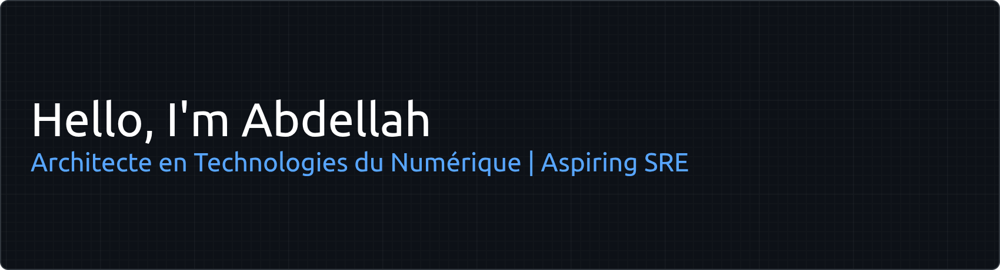

**Architecte en Technologies du Numérique (Trainee) | Aspiring Site Reliability Engineer**

I am currently training at 1337 (UM6P) with a strong focus on systems programming, backend architecture, and building reliable digital infrastructure. I prefer working quietly, diving deep into code, and letting the quality of my work speak for itself. 

---

## About Me

* I lean toward analytical thinking, debugging complex issues, and understanding how systems work under the hood.
* Passionate about low-level programming, computer architecture, and infrastructure.
* Advocate for minimal aesthetics, clean code, and dark mode.
* I listen more than I speak, and build more than I show.

---

## Current Technical Stack

* **Languages:** C, Python
* **Environments & Tools:** Linux (Fedora, Ubuntu), Git

---

## Education

* **1337 Coding School (UM6P):** "Architecte en Technologies du Numérique" Track
  * Peer-to-peer, project-based software engineering education.
  * Focused on rigorous C programming, algorithms, multithreading, and systems architecture.

---

## Goals & Learning Trajectory (Next 6 Months)

* **Languages:** Expanding my foundation to include **C++** and **Go**.
* **Infrastructure:** Initiating my learning path into SRE methodologies, containerization, and system monitoring tools.
* **Open Source:** Preparing for **GSoC 2027** by exploring and understanding the architecture of major open-source infrastructure projects.

---

> "Quiet minds build powerful systems."
